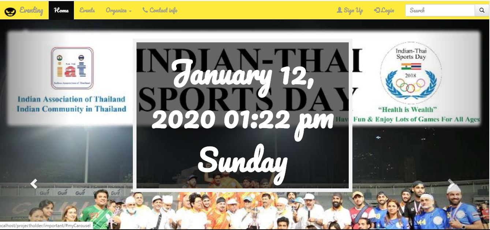

# Web-Application-Term-Project
term project of semester 2/2018

## This project is about booking tickets to go for an event in terms of 2 different perspective organizer and participants.

### Organizer are the one who organize or create the events and handle in removing events or participants from an event

### participant are people like us who want to buy tickets online to visit an event with friends family or others. it can be concerts seminars and any other events.

Code link:
https://drive.google.com/open?id=1fyPmShd1s2a33-Y3U6uncr5JmReP8_Vr

##                  Homepage of the website

# Programming and Web Languages used to code:

##                                html

##                                css

##             javascript(for sliding carousel and some more parts)

##                      sql

### php

# Some of the files in this folder are unrelated to the projects also

